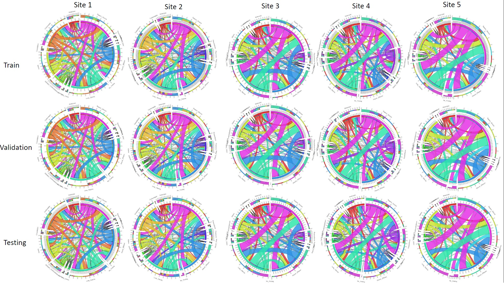
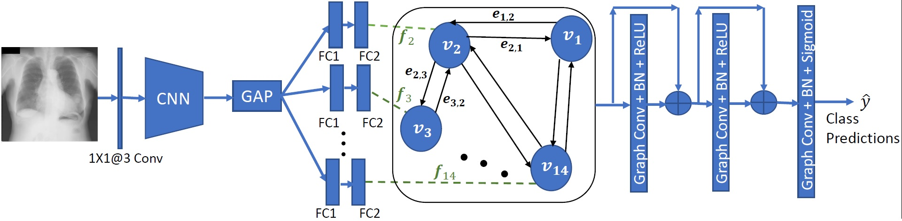
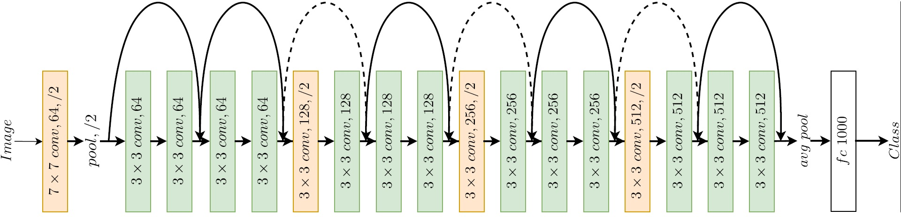

# Federated Learning for Site Aware Chest Radiograph Screening 

<div id="abs">

The shortage of Radiologists is inspiring the development of Deep Learning (DL) based solutions for detecting cardio, thoracic and pulmonary pathologies in Chest radiographs through multi-institutional collaborations. However, sharing the training data across multiple sites is often impossible due to privacy, ownership and technical challenges. Although Federated Learning (FL)[[1](#fedl)] has emerged as a solution to this, the large variations in disease prevalence and co-morbidity distributions across the sites may hinder proper training. To simulate such a scenario, the CheXpert[[2](#chexpert)] dataset is distributed among 5 clients keeping different co-morbidity distributions across sites.

<figure align='center'>

<figcaption>Class co-occurrence distribution at each site</figcaption>
</figure>

This code trains a Convolutional Neural Network (CNN) followed by a Graph Neural Network (GNN)[[3](#gnn)] to predict labels in chest radiographs by modifying the Federated Averaging algorithm. The CNN weights are shared across all sites to extract robust features while separate GNN models are trained at each site to leverage the local co-morbidity dependencies for multi-label disease classification. 
<figure align='center'>

<figcaption>The CNN-GNN architecture</figcaption>
</figure>
Separate Fully Connected (FC) layers are employed to obtain different 512-Features for each class. These are used as node features to construct a graph whose edges capture the co-occurrence dependencies between the classes at each site. The graph is provided as input to a Graph Neural Network to obtain the prediction labels for each node. The entire CNN-GNN architecture is trainable in an end-to-end manner
</div>

## Network Architecture:

We have used ResNet-18 as the base architecture.

<figure align='center'>

<figcaption>ResNet 18 architecture</figcaption>
</figure>
  

## Results

AUROC scores for each class and Mean AUROC score is reported.
| Class | Site 1 | Site 2 | Site 3 | Site 4 | Site 5 |
|--|--|--|--|--|--|
| No Finding | 0.9074 | 0.8680 | 0.9223 | 0.8443 | 0.8610 |
| Enl. Cardiom. | 0.7442 | 0.7946 | 0.8301 | 0.8717 | 0.7563 |
| Cardiomegaly | 0.7866 | 0.8038 | 0.8376 | 0.8499 | 0.7204 |
| Lung Opacity | 0.7312 | 0.7623 | 0.6440 | 0.6770 | 0.8514 |
| Lung Lesion | 0.7742 | 0.7487 | 0.7772 | 0.7467 | 0.7001 |
| Edema | 0.7956 | 0.8233 | 0.8234 | 0.8233 | 0.8805 |
| Consolidation | 0.6435 | 0.7847 | 0.7298 | 0.7754 | 0.8077 |
| Pneumonia | 0.7011 | 0.7425 | 0.7621 | 0.7429 | 0.8193 |
| Atelectasis | 0.6442 | 0.6909 | 0.6720 | 0.6743 | 0.7495 |
| Pneumothorax | 0.8064 | 0.8614 | 0.8136 | 0.8290 | 0.7915 |
| Pleural Effusion | 0.8425 | 0.8661 | 0.8140 | 0.7962 | 0.9047 |
| Pleural Other | 0.8332 | 0.8016 | 0.8212 | 0.7958 | 0.8360 |
| Fracture | 0.7226 | 0.7222 | 0.7333 | 0.7979 | 0.7495 |
| Support Devices | 0.8461 | 0.8550 | 0.8380 | 0.8261 | 0.9155 |
| **Average** | 0.7699 | 0.7947 | 0.7870 | 0.7893 | 0.8102 |

Note: The network was trained for 40 communication rounds. 

## **Setup**

### Prerequisites

* Ubuntu\* 16.04
* Python\* 3.6
* NVidia\* GPU for training
* 16GB RAM for inference

## **Train**

1. Download the [RSNA Dataset](https://www.kaggle.com/c/rsna-pneumonia-detection-challenge/data)
2. Create the directory tree
3. Prepare the training dataset
4. Run the training

## **Code Structure**
1. `data_preprocess.py` in the main directory contains the code for data resizing. 
2. `main_training.py` in the main directory contains the code for training the model.
3. `main_test.py` in the main directory contains the code for test a model.
4. Inside Utils directory, `average_utils.py`, `data_utils.py`, `model_utils.py`, `performance_utils.py` and `train_utils.py` files contain necessary functions and classes for both training and inference.

### Directory Tree
+-- Data
|   +-- Train_reshaped
+-- Media
+-- Models
+-- Utils

Raw [data](https://stanfordmlgroup.github.io/competitions/chexpert/) can be stored in any directory in the machine. Download the data split info file from [here](https://bit.ly/2RwQ6KR) and place it inside the 'Data' directory.

### Prepare the Dataset
The raw images are required to be reshaped before being fed to the model. Execute the following command:
```
python data_preprocess.py --dpath='<directory, where the dataset is kept>'
```
For example if the data is inside '/home/datasets/' then execute-
```
python data_preprocess.py --dpath='/home/datasets/'
```
The reshaped data will be saved inside the './Data/Train_reshape' directory in `.jpg` format.
### Run Training

Run the `main_training.py` script. It does not take any argument.
```
python main_training.py
```
Best performing model weights (Both local and global) weights will be stored inside the 'Models' directory.

## How to Perform Prediction

### Run Test
```
python main_test.py
```
The saved global and local model combinations will be used in the inference of 5 local datasets.

## **Acknowledgement**
This work is undertaken as part of Intel India Grand Challenge 2016 Project MIRIAD: Many Incarnations of Screening of Radiology for High Throughput Disease Screening via Multiple Instance Reinforcement Learning with Adversarial Deep Neural Networks, sponsored by Intel Technology India Pvt. Ltd., Bangalore, India.

**Contributor**

The codes/model was contributed to the OpenVINO project by

<a href="https://www.linkedin.com/in/karavik18/">Avik Kar</a>, </br>
Department of Electrical Engineering, </br>
Indian Institute of Technology Kharagpur</br>
email: karavik@gmail.com</br>
Github username: karavik18

<a href="https://www.linkedin.com/in/arunava-chakravarty-b1736b158/">Arunava Chakravarty</a>, </br>
Department of Electrical Engineering, </br>
Indian Institute of Technology Kharagpur</br>
email: arunavachakravarty1206@gmail.com </br>
Github username: arunava555


**Principal Investigators**

<a href="https://www.linkedin.com/in/debdoot/">Dr Debdoot Sheet</a>,</br>
Department of Electrical Engineering,</br>
Indian Institute of Technology Kharagpur</br>
email: debdoot@ee.iitkgp.ac.in

<a href="https://www.linkedin.com/in/ramanathan-sethuraman-27a12aba/">Dr Ramanathan Sethuraman</a>,</br>
Intel Technology India Pvt. Ltd.
email: ramanathan.sethuraman@intel.com

## **References**

<div id="fedl">
<a href="#abs">[1]</a> B. McMahan et. al. , “Communication efficient  learning of deep networks from decentralized data,” AISTATS,  2017, pp. 1273–1282. <a href="https://arxiv.org/pdf/1602.05629.pdf"> (link) </a>
</div>
<div id="chexpert">
<a href="#results">[2]</a>  Irvin, Jeremy, Pranav Rajpurkar, Michael Ko, Yifan Yu, Silviana Ciurea-Ilcus, Chris Chute, Henrik Marklund et al. &quot;Chexpert: A large chest radiograph dataset with uncertainty labels and expert comparison.&quot; In _Proceedings of the AAAI Conference on Artificial Intelligence_, vol. 33, pp. 590-597. 2019. <a href="https://arxiv.org/abs/1901.07031"> (link) </a>
</div>
<div id="gnn">
<a href="#results">[3]</a>  S. Martin et. al., “Dynamic edge-conditioned filters in convolutional neural networks on graphs,” CVPR, 2017, pp. 29–38. <a href="https://arxiv.org/pdf/1704.02901.pdf"> (link) </a>
</div>
<div id="resnet">
<a href="#abs">[4]</a> H Kaiming, Z Xiangyu, R Shaoqing, et al., “Deep residual learning for image recognition,” CVPR, 2016, pp. 770–778. <a href="https://arxiv.org/pdf/1512.03385.pdf"> (link) </a> 
</div>
